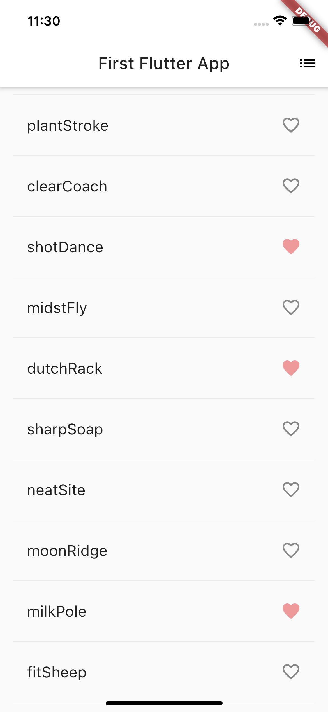
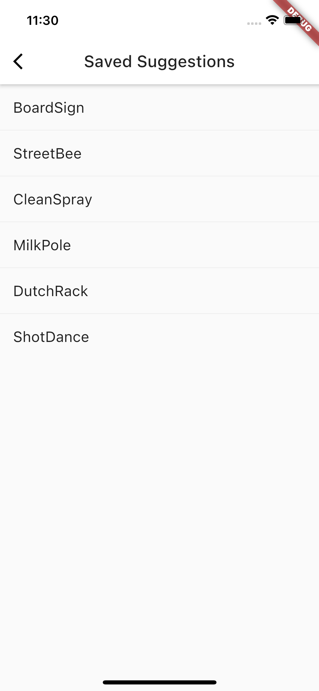

# My First Flutter App 🔥

This app will give suggestion for a startup name / username

### Learned:
1. Set up Flutter environment
2. Use external package
3. Add Stateful Widget
4. Create an infinite scrolling ListView
5. Add icons to the list
6. Add interactivity to the icon
7. Create route
8. Change UI using theme

*screenshots from iOS simulator
> main screen with ListView
    

> second page with saved favourite list

✅ Done by Tyler Nguyen